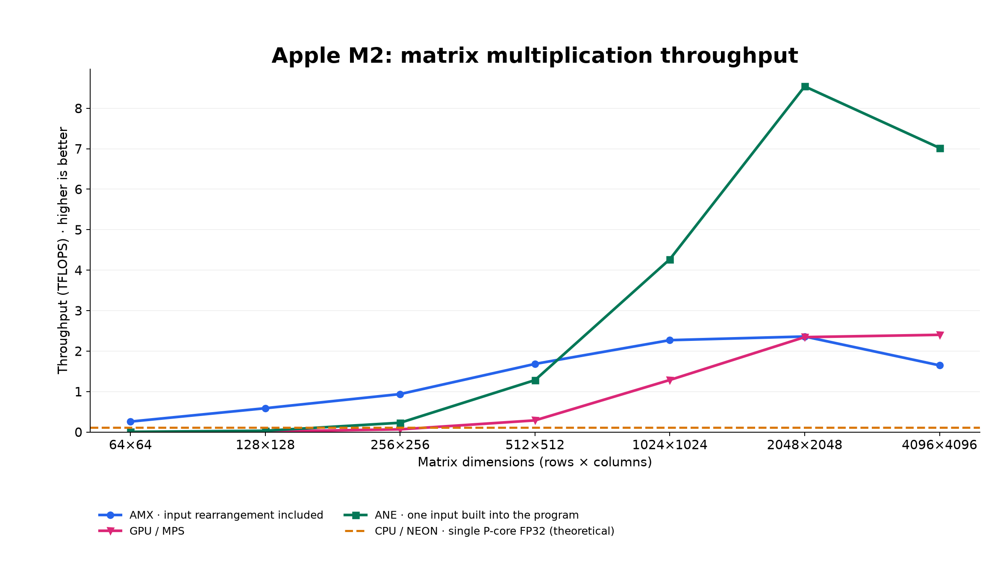

# Apple M2 GEMM: AMX vs. GPU vs. ANE

This project benchmarks matrix multiplication (GEMM) on Apple M2’s AMX matrix coprocessor, GPU, and Apple Neural Engine (ANE). It compares GEMM throughput across matrix sizes.

**[Read the article](article/m2-benchmark.md)** · **[Run the benchmarks](#quick-start)**

## Results

At N=2048, ANE with constant B reaches **8.54 TFLOPS**, compared with **2.34 TFLOPS** through GPU/MPS. Custom AMX reaches **2.93 TFLOPS** with prepacked inputs, or **2.36 TFLOPS** when packing is included. Precision differs between paths, as shown below.

**Hardware:** MacBook Air (Mac14,15), M2 (8-core CPU, 10-core GPU), 16 GB memory.

Square GEMM with **M = N = K = 2048**.

| Implementation | Arithmetic / I/O | Mean (ms) | TFLOPS |
| :--- | :--- | ---: | ---: |
| **AMX GEMM, including A/B packing** | FP16 × FP16 → FP16 | 7.28 | **2.36** |
| **AMX GEMM, A/B prepacked** | FP16 × FP16 → FP16 | 5.87 | **2.93** |
| AMX / BNNS | FP16 × FP16 → FP32 | 12.01 | 1.43 |
| AMX / Accelerate SGEMM | FP32 × FP32 → FP32 | 14.80 | 1.16 |
| GPU / MPS | FP16 I/O | 7.33 | 2.34 |
| ANE / constant B | FP16 I/O | 2.01 | 8.54 |
| ANE / runtime A, B | FP16 I/O | 3.29 | 5.22 |

Prepacked excludes A/B packing time. Arithmetic entries show input and accumulation precision; FP16 I/O specifies buffer precision only, with GPU/ANE accumulation precision unverified.

See the article for [compute throughput references](article/m2-benchmark.md#1-compute-throughput-references) and throughput as a percentage of each reference.

### Performance across matrix sizes



CPU/NEON is the single-P-core theoretical reference (0.112 TFLOPS, dashed). Measured curves use AMX with A/B packing, GPU via MPS, and ANE with constant B.

## Quick start

Requires Apple Silicon and Python 3.11. Tested on M2/macOS.

```bash
# Install
git clone https://github.com/ToExperienceMore/apple-m2-gemm-benchmarks.git
cd apple-m2-gemm-benchmarks
python3.11 -m venv .venv
.venv/bin/python -m pip install -r requirements.txt

# Build
.venv/bin/python scripts/build.py

# Run
.venv/bin/python scripts/benchmark.py --sizes 64 128 --output runs/quick-check

# Summarize
.venv/bin/python scripts/summarize_run.py runs/quick-check
```

Results: `runs/quick-check/summary.md` and `runs/quick-check/summary.csv`.

Use a new `--output` directory for each run. Without `--output`, results go to `runs/<timestamp>/`.

### Full benchmark

```bash
.venv/bin/python scripts/benchmark.py --suite all --output runs/full
.venv/bin/python scripts/summarize_run.py runs/full
```

Runs N=64, 128, 256, 512, 1024, 2048 and 4096, followed by three AMX instruction tests. Allow several minutes and roughly 2 GB of working space. Results: `runs/full/summary.md` and `runs/full/summary.csv`.

Use `--sizes 2048` for one matrix size, `--suite gemm` for GEMM only, or `--suite amx` for instruction tests only. Instruction-only runs produce `summary.md` and instruction CSVs, without a GEMM `summary.csv`.

The published GEMM measurements used battery power; the AMX instruction reference used AC power. To match those conditions, run the suites separately:

```bash
# Battery power
.venv/bin/python scripts/benchmark.py --suite gemm --output runs/gemm-battery
# AC power
.venv/bin/python scripts/benchmark.py --suite amx --output runs/amx-ac
```

### Reading results

In the summary, `cpu` means BNNS/AMX, `sgemm` means Accelerate SGEMM, and `gpu` means MPS. `ane-constant` and `ane-dynamic` use constant B and runtime A+B respectively. `amx-fp16-prepacked` excludes A/B packing.

`Relative L2` reports error against the FP32 reference. FP16 accumulation can produce larger errors while passing its own validation. The N=64/128 quick check verifies execution and correctness; compare performance at matching matrix sizes, precision, thread counts and power conditions.

## Measurement conditions

For each matrix size, the runner performs 10 warmup calls, then records 10 samples of 10 calls each. Each sample reports elapsed time per call; the summary reports the mean across samples. Calls wait for computation to complete and reuse preallocated input/output buffers.

AMX packing rearranges inputs into the kernel's required memory layout. The packing-included result times this work on each call; the prepacked result prepares the inputs before timing. ANE constant B embeds one input matrix in the compiled program; the runtime-input version supplies both matrices at execution.

- **Hardware:** MacBook Air M2, 4 performance + 4 efficiency CPU cores, 10-core GPU, 16 GB memory.
- **Inputs:** the same reproducible random FP16 values for every implementation, converted to FP32 for SGEMM. Buffers are reused without clearing caches. Even when both ANE inputs are passed at execution, their values stay unchanged during timing.
- **Threads:** BNNS is tested with 1, 4 and 8 threads; custom AMX with 1 and 4 workers. Results show the fastest mean at each matrix size. SGEMM uses `VECLIB_MAXIMUM_THREADS=8`.

Timing excludes memory allocation, compilation, initial data copies and correctness checks. BNNS/SGEMM timing includes any input rearrangement inside the libraries. MPS timing includes submitting prepared GPU commands and waiting for completion. ANE timing covers native execution and completion using buffers already in place.

## Numerical validation

All implementations use the same seeded FP16 matrices. Checks run automatically, outside timing:

- **BNNS/MPS:** full FP32 reference, `rtol=0.01`, `atol=0.01`.
- **SGEMM:** full FP32 reference, output rounded to FP16 for checking, `rtol=0.001`, `atol=0.001`.
- **ANE:** full FP32 reference, `rtol=0.001`, `atol=0.001`, plus 64 FP64 dot-product checks.
- **Custom AMX:** all outputs for N≤128, otherwise 128 dispersed positions, checked against sequential scalar hardware FP16 FMA. FP32-relative L2 error is reported separately.

## Troubleshooting

- **ANE failure:** inspect the run's ANE `.log` file. ANEForge uses OS-dependent private APIs; the recorded experiments used macOS. The GEMM suite includes ANE without automatic fallback or an option to skip it.
- **Incomplete run:** a failed command or validation check stops the runner. The summarizer rejects runs without `VALID.json`; inspect the terminal error and run logs.
- **Different performance:** compare matrix size, precision, packing, thread count, power source and background load. The suite does not lock clocks or pin a physical core.

## Source and results

- **AMX:** [FP16 GEMM kernel](src/amx/gemm_fp16.cpp) and [instruction benchmark](src/amx/perf_filtered.c).
- **AMX and GPU via Apple libraries:** [BNNS, Accelerate SGEMM and MPS](src/library_gemm.mm).
- **ANE:** [graph construction](src/ane/matmul_ane.py), [runtime setup](src/ane/matmul_native_timer.py) and [native timer](src/ane/matmul_native_timer.c).

- [Recorded results](results/) — raw samples and comparison tables ([CSV](results/library/comparison.csv), [JSON](results/library/comparison.json)).
- [Execution-path evidence](evidence/README.md) — sampling, disassembly and runtime checks.

## Acknowledgments

AMX instruction tests use [Corsix AMX](https://github.com/corsix/amx); ANE tests use [ANEForge](https://github.com/sbryngelson/ANEForge). See [third-party attribution and licenses](THIRD_PARTY.md).
