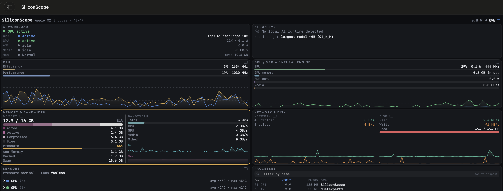

# Execution-path evidence

[SiliconScope](https://github.com/kennss/SiliconScope) shows CPU, GPU and ANE activity while a workload runs. It does not show AMX. For AMX, we use sampling, disassembly and breakpoints to confirm AMX execution and determine the accumulation precision.

## Watching engine activity with SiliconScope

Run SiliconScope alongside the benchmark to observe GPU utilization and ANE activity as the workload starts and finishes.



*SiliconScope on the test machine: GPU utilization is 29%, while the ANE is idle at 0.0 W.*

ANE activity is a [power-based estimate](https://github.com/kennss/SiliconScope/blob/main/docs/display-spec.md), separate from the article's throughput-to-reference percentages.

## Detailed execution-path verification

The following records and reproduction steps document each execution path. Paths in historical traces refer to the original experiment layout.

### BNNS (AMX), N=2048, one thread

1. `cpu-sample.txt`: the sampled stack leads through `BNNSMatMul` to the hot PC at `libBNNS.dylib + 0x553038`.
2. `bnns-disasm.txt`: machine code at the hotspot includes `0x002012a8`.
3. `bnns-hit.txt`: a real runtime breakpoint hits the instruction and records `x8=0x00000c0000000000`, with the stack back to `BNNSMatMul`.

Decode: instruction base `0x201000`, opcode 21, GPR 8 → `AMX_MATFP(x8)`. Lane mode `(x8 >> 42) & 15 = 3`, ALU mode 0: FP16 inputs, FP32 accumulation, `z+x*y`. [Corsix MATFP](https://github.com/corsix/amx/blob/main/matfp.md)

### SGEMM (AMX), N=2048

`sgemm-sample.txt` and `sgemm-hit.txt` connect `cblas_sgemm` to the hotspot at `libBLAS.dylib + 0x339bd4`. The breakpoint hits `0x00201189 = AMX_FMA32(x9)`, with `x9=0x200040`. Bits 60/61 (FP16 inputs) are zero, and bit 63 selects matrix mode. [Corsix FMA](https://github.com/corsix/amx/blob/main/fma.md)

### Custom FP16 GEMM (AMX)

`fp16-gemm-disassembly.txt` records the compiled tile loop. Its two MATFP operands have lane mode 2: FP16 X/Y/Z on M2. The source also specifies this mode explicitly; validation checks sequential hardware FP16 FMA output.

### MPS and ANE

For MPS, inspect `src/library_gemm.mm`: Metal device and buffers, MPS encode, command completion/error checks, and GPU timestamp collection. The actual timestamp samples are in the published library JSON records.

For ANE, inspect `src/ane/matmul_native_timer.py`: it requires `_device_mask == ANE_MASK`. The pinned runtime defines CPU=1, GPU=2, ANE=4. Published constant/dynamic JSON rows contain `device_mask: 4`; the native C timer calls the loaded program's execute function. This is runtime routing evidence, not an ANE firmware instruction trace.

### Repeat a CPU-side diagnostic

Build and generate a run first. In one terminal, launch a longer native benchmark with its existing input directory:

```bash
build/library_gemm cpu 2048 10 100 10 1 runs/YOUR_RUN/2048 /tmp/bnns-output.bin /tmp/bnns-output.json &
pid=$!
sample "$pid" 2 1 -file /tmp/bnns-sample.txt
wait "$pid"
```

For SGEMM, substitute mode `sgemm`, set `VECLIB_MAXIMUM_THREADS=8`, and use separate outputs. Launch LLDB on the same command, set a breakpoint at `BNNSMatMul` or `cblas_sgemm`, then `run`. Once the library is loaded, disassemble your sampled hotspot (`disassemble -s ADDRESS -c 40 -b`), set a breakpoint there, `continue`, read the operand register, and capture `bt`.

The absolute addresses in the supplied records apply to the original machine/shared cache only. The verification covers N=2048 for library paths, not every possible shape.
